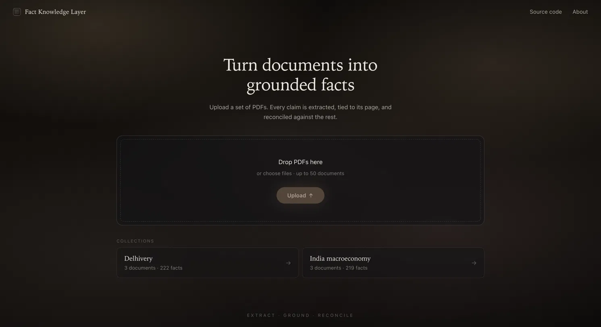
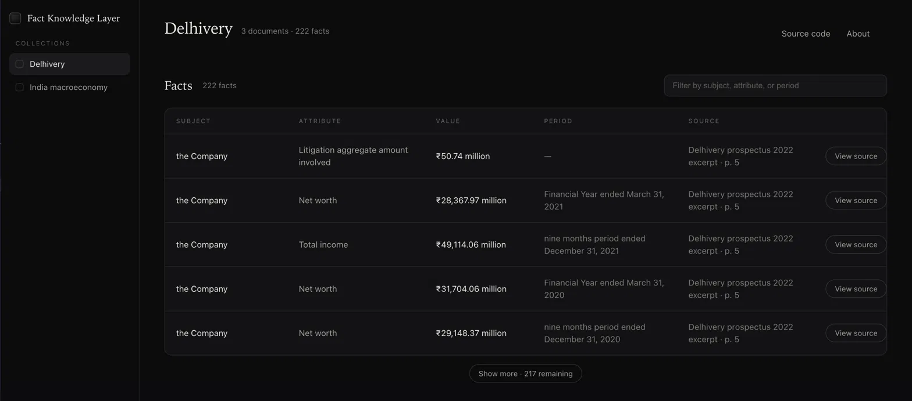
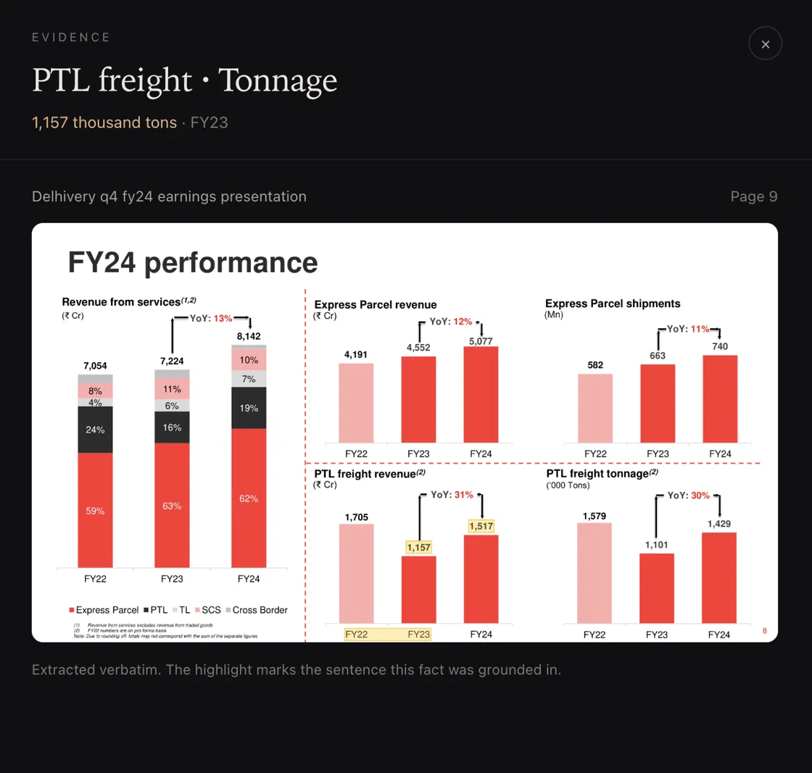

# Fact Knowledge Layer

A system that reads a set of PDFs, pulls out the facts stated in them, ties every fact back to
the exact sentence it came from, and works out where those facts agree, disagree, or only *look*
like they disagree.

It is built around one idea: the hard part isn't extracting facts, it's deciding whether two
facts that look different are actually in conflict. ₹8,142 Cr and ₹81,415.38 million are the
same number. FY24 revenue and Q4 FY24 revenue are not a contradiction. A director who is "active"
in a 2022 prospectus and "resigned" in a 2024 report genuinely conflicts. Telling these apart is
the whole game, and it's what this system spends most of its effort on.



## The problem

Facts that matter are scattered across documents, written differently in each, sometimes backed
up by other sources and sometimes contradicted. A revenue figure in a prospectus, an annual
report, and an earnings deck will rarely match exactly — they cover different periods, use
different units (₹ crore vs ₹ million), or report on a different scope (standalone vs
consolidated). A naive comparison flags all of these as contradictions. The interesting work is
separating a real conflict from a difference that context explains.

## Approach and architecture

The system is a pipeline, not a chatbot. A document goes through six stages:

**parse → extract → ground → normalize → match → reconcile**

1. **Parse** — PyMuPDF pulls per-page text and per-word coordinates; pdfplumber handles tables.
2. **Extract** — each page is sent to Gemini with a strict prompt that returns structured facts,
   each carrying a verbatim quote of the sentence it came from.
3. **Ground** — the verbatim quote is located back in the page with PyMuPDF's `search_for`, which
   gives the page number and a bounding box. This step is deterministic — the page location comes
   from code searching the real text, never from the model. If a quote isn't found verbatim on the
   page, the fact is dropped. That is what makes the evidence trustworthy.
4. **Normalize** — this is the core. Every fact is split into a **value** and a **context
   signature**: `{period, scope, basis, vintage}`. Units are canonicalised to a base (₹ Cr, ₹
   million and ₹ lakh all resolve to plain rupees). Periods are parsed into a structure that knows
   `FY24`, `Q4 FY24`, `2024-25` and `FY2024/25` and can tell that a quarter sits *inside* a year.
5. **Match** — facts about the same subject and attribute are paired, but only across different
   documents (a document agreeing with itself isn't news). Matching is three layers: deterministic
   blocking on strong keys (a director's DIN, a company's CIN must match exactly — similar names
   never override that), embeddings only to catch spelling and wording variants of weak name keys,
   and deterministic-first per-pair scoring with an embedding fallback.
6. **Reconcile** — for each pair, the verdict is decided by **deterministic rules over the context
   signature**, not by the model. Same context and equal values → corroborate. Same context,
   different values → contradict. Different context → reconcilable, and the reason names exactly
   which field differs (period, scope, basis, or vintage). A language model only ever rewrites the
   one-line explanation into fluent English — it is explicitly barred from changing the verdict.

The payoff of the context signature: "8,142 Cr" and "81,415.38 million" corroborate once units are
resolved; "FY24 revenue" and "Q4 FY24 revenue" reconcile because a quarter is part of a year, not a
disagreement with it; and two genuinely different values under identical context are flagged as a
real contradiction.

Nothing in the schema is document-specific. The `attribute` field is free text, so a new kind of
fact simply appears as a new attribute — the system was never told what a "revenue" or a "board
status" is.



### The four required cases

All four are demonstrated on the real starter data (Delhivery filings and Indian macroeconomic
reports), visible in the Relationships view.


1. **Corroboration, expressed differently** — India's FY25 real GDP growth is reported as ~6.5% by
   the IMF, RBI and the Economic Survey across three different notations for the same fiscal year;
   the system maps them to one period and marks them corroborated. In the Delhivery set, FY24
   consolidated revenue of ₹81,415.38 million (annual report) corroborates ₹8,142 Cr (earnings
   deck) once units are resolved.
2. **Genuine contradiction** — Suvir Suren Sujan is listed as an active Non-Executive Nominee
   Director in the 2022 prospectus, but the FY24 annual report records his resignation (24 Aug
   2023). Same person (matched on DIN), opposite board status → contradiction.
3. **Apparent contradiction, reconciled by context** — Delhivery's FY24 revenue and its Q4 FY24
   revenue differ roughly fourfold. The system reconciles them: a quarter is a subset of the year,
   not a conflicting figure. Standalone vs consolidated revenue for the same year reconciles the
   same way, on scope.
4. **A failure I found** — see "What I got wrong" below; several are documented honestly rather
   than hidden.

### Evidence

Every fact links to its source. Clicking a fact renders the actual PDF page with the grounded
sentence highlighted — the page location comes from the deterministic grounding step, so it's the
real sentence, not a reconstruction.



## Setup and run instructions

Requires Python 3.12+ and Node 18+. A Gemini API key is needed only to *ingest new documents* —
the shipped database already contains the extracted facts, so the interface runs without a key.

```bash
# 1. Backend
python -m venv .venv
source .venv/bin/activate
pip install -r requirements.txt

# copy the env template and add your key (only needed for new ingestion)
cp .env.example .env
# edit .env -> GEMINI_API_KEY=...

# 2. Run the API (serves the included data/facts.db)
uvicorn backend.app:app --reload          # http://localhost:8000  (/docs for the API)

# 3. Run the UI, in a second terminal
cd frontend
npm install
npm run dev                                # http://localhost:5173
```

Open http://localhost:5173. The two shipped collections (Delhivery, India macroeconomy) load
immediately with their facts and relationships.

**Ingesting a new PDF** (needs a Gemini key, writes to a separate DB so the shipped data is never
touched):

```bash
python scripts/ingest.py --collection mydocs \
  --pdf /path/to/a.pdf --pdf /path/to/b.pdf \
  --db data/mydocs.db --max-pages 5
```

Ingestion runs offline through this script by design — the web UI is read-only. Note that
evidence rendering depends on the source PDFs staying at the path recorded at ingest time.

## What I got wrong (and how I handled it)

I kept a running list of real failures found while building, because catching them is most of the
point of a system like this. A few:

- **Tests green, output wrong.** The reconciliation logic was correct, but the human-readable
  reason for a period-subset case printed the part and whole backwards ("Q4 covers FY24"). Unit
  tests passed while the sentence was wrong — only reading real output caught it. Fixed, with a
  test that asserts the wording in both argument orderings.
- **A budget cap that silently dropped facts.** Capping the model's thinking budget to save quota
  made it walk past a multi-column revenue table entirely — it extracted the current-year columns
  and skipped the prior year. Raising the cap recovered them. A clear trade-off: cheaper extraction
  costs coverage on dense tables.
- **A false contradiction from a schema conflation.** Two IMF figures for the same GDP growth read
  as a contradiction because one was tagged `basis=real` and the other `basis=GDP at market
  prices`. These aren't opposing values — they describe two different axes (a price basis and an
  aggregate). I fixed it by treating a basis as a set of facets that conflict only when they
  disagree on the *same* axis, rather than aliasing specific strings, so it generalises.
- **A sign error on financial data.** `(452) Cr` — an accounting loss — parsed as +452 because the
  parenthesis-negative rule broke when a unit trailed the number. On financial documents this is
  the dangerous kind of bug; fixed and tested.
- **A date read as a number.** `parse_number("August 24, 2023")` returned `242023` because the
  digit-grouping pattern allowed a comma-space. This misclassified a resignation date as a
  measurement. Fixed.
- **A normalization pass reading its own output.** The board-status rule re-classified facts from
  the attribute it had itself just written, silently erasing contradictions. Now it reads the
  document's original attribute, with an idempotency test that runs it three times.

## Limitations and next steps

- **Gemini free tier caps everything.** The free tier allows ~20 requests/day, one call per page.
  So the shipped data covers the ~26 pages where the demonstrated facts live, not all ~500 pages of
  the six documents. This is a cost choice, not a design limit — the same pipeline handles a whole
  document via the same endpoint. For the same reason, the web UI's upload box is disabled and
  ingestion runs through the CLI; enabling live upload would call the model per page and burn the
  daily quota on a single click.
- **Why not a local embedder (Ollama etc.).** The system ships with an offline hashing embedder as
  a fallback, but the primary path uses Gemini embeddings when a key is present. I chose not to
  depend on a local model server (Ollama, sentence-transformers) because it would force whoever
  runs this to install and pull a model before anything works — a real cost to "runs from my
  instructions." The hashing fallback keeps it working with zero setup and zero network.
- **Matching thresholds are calibrated for the offline embedder.** The similarity thresholds were
  tuned against the lexical hashing embedder. With a Gemini key configured, embeddings shift to a
  semantic scale and the thresholds should be re-tuned — a known calibration gap.
- **Categorical conflicts sit outside the numeric guardrail.** Text-valued facts (like board
  status) are compared on a separate categorical path, added deliberately so the director
  contradiction could surface without weakening the rule that stops false *numeric* contradictions.
- **Known extraction gaps.** On some multi-row tables the extractor keeps the subject varying per
  row instead of the attribute; and the temporal parser handles "as of" but not every phrasing of a
  date range. Both are documented rather than papered over.
- **Next steps.** Table-aware extraction (parsing tables by column rather than flattened text) would
  close most of the extraction gaps; a job queue would make large-PDF ingestion interactive; and
  re-tuning the thresholds for semantic embeddings would improve matching once off the free tier.

## AI tools used

Built with Claude Code as a pair-programmer for the implementation, under close review at each
phase — the schema, normalization rules, and every fact and verdict shown were designed and
verified by me. Gemini is the only external model in the running system (extraction, the
reason-text rewrite, and embeddings when a key is present).

## Additional notes

- **Brownie points reached:** a dynamically-evolving schema (free-text attributes — new fact types
  need no schema change), and many PDFs in one knowledge layer (collections pool facts and reconcile
  across all documents in them). Ingestion is incremental — a new document appends its facts and is
  matched against the existing pool.
- **Git:** built in phases with a clean, single-contributor history.
- **The shipped database is deliberately frozen.** Because extraction is non-deterministic and the
  matching thresholds are calibrated for the embedder that produced the current verdicts, the
  demonstrated relationships live in the committed `data/facts.db` and are best viewed as-is rather
  than regenerated.
